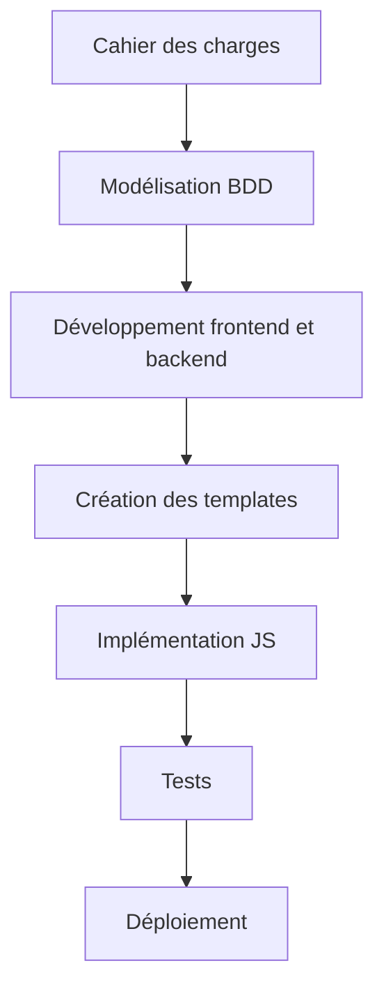

# SAÉ 2.03 : Plateforme de Ludothèque

[](https://www.djangoproject.com/)
[](https://www.mysql.com/)
[](https://nginx.org/)
[](https://gunicorn.org/)

## 📖 Description du projet
Cette SAÉ consistait à développer une application web complète pour la gestion d'une ludothèque sur le modèle de Steam. Réalisé en équipe de trois étudiants, le projet étatait sensé comprendre:

- Interface de gestion de jeux avec catégories, auteurs et éditeurs
- Système d'inscription et d'authentification pour les joueurs
- Fonctionnalités de commentaires et de notation des jeux
- Listes personnalisées de jeux par joueur
- Calcul des moyennes de notes par jeu

**État actuel du projet** :  
L'application est déployable sur une machine virtuelle Linux avec l'architecture Nginx + Gunicorn et utilise une base de données MySQL. Le prototype actuel présente le design final et la logique applicative, avec une implémentation partielle des fonctionnalités.

## ✨ Fonctionnalités implémentées
- **Base de données** : Modèle relationnel complet (fichier `ludotheque.sql`)
- **Interface utilisateur** : Design responsive avec système de filtrage JavaScript
- **Backend** : Architecture Django avec routage d'URLs et formulaires
- **Frontend** : Templates HTML/CSS pour les principales vues
- **Gestion de projet** : Organisation avec diagramme de Gantt

## 🛠️ Technologies utilisées
| Catégorie        | Technologies                               |
|------------------|--------------------------------------------|
| Backend          | Python, Django                             |
| Base de données  | MySQL                                      |
| Frontend         | HTML5, CSS3, JavaScript                    |
| Déploiement      | Nginx, Gunicorn, Linux                     |
| Gestion de code  | Git, GitHub                                |

## 📸 Galerie du projet

1. Page d'accueil avec liste des jeux
   
   
2. Liste de jeux pour utilisateur spécifique
   
   
3. Page de gestion de compte utilisateur
   

4. Diagramme de la logique applicative
   


## 🧠 Compétences développées
### AC13.01 : Utiliser un système informatique et ses outils
- Maîtrise de l'environnement Linux
- Déploiement avec Nginx et Gunicorn
- Gestion de l'écosystème Python/Django

### AC13.02 : Lire, exécuter, corriger et modifier un programme
- Développement itératif du code Django
- Debugging des composants backend
- Refactoring de la base de données

### AC13.03 : Traduire un algorithme dans un langage
- Implémentation des algorithmes de calcul de notes
- Logique de filtrage côté client (JavaScript)
- Traitement des fichiers CSV

### AC13.04 : Architecture et technologies d'un site Web
- Architecture MVC avec Django
- Gestion des requêtes HTTP
- Séparation logique frontend/backend

### AC13.05 : Gestion de données adaptées
- Modélisation relationnelle avancée
- Requêtes SQL
- Schéma de base de données normalisé

### AC13.06 : Travail collaboratif
- Gestion de projet avec diagramme de Gantt
- Versionning avec GitHub
- Répartition des tâches en équipe

## 📋 Méthodologie
1. **Analyse des besoins** : Modélisation UML et conception de la BDD
2. **Conception architecturale** : Django + MySQL + Nginx
3. **Répartition des tâches** : Diagramme de Gantt
4. **Développement itératif** : 
   - Implémentation de la base de données
   - Développement des vues principales
   - Création des templates HTML
5. **Documentation** : Procédures d'installation et manuel technique



## 🚀 Installation
1. Cloner le dépôt :
```bash
git clone https://github.com/anonymousapexio/ludotheque.git
cd ludotheque
```

2. Configurer l'environnement virtuel :
```bash
python -m venv venv
source venv/bin/activate
```

3. Installer les dépendances :
```bash
pip install -r requirements.txt
```

4. Importer la base de données :
```bash
mysql -u utilisateur -p ludotheque < ludotheque.sql
```

5. Configurer les variables d'environnement dans `settings.py` :
```env
DATABASES = {
    "default": {
        "ENGINE": "django.db.backends.mysql",
        "USER": "[NOM UTILISATEUR BASE DE DONNEE]",
        "PASSWORD": "[MOT DE PASSE ADMIN BASE DE DONNEE]",
        "HOST": "[ADRESSE IP OU NOM DE DOMAINE]",
        "PORT": "[PORT] (3306 pour MySQL/MongoDB, 5432 pour PostGres, 1521 pour Oracle, 1433 pour Microsoft SQL Server)",
    }
}
```

6. Lancer le serveur de développement :
```bash
python manage.py runserver
```

## 📚 Conclusion
### Ce que j'ai appris
Ce projet m'a permis d'acquérir une expérience concrète dans :
- Le développement full-stack avec Django
- La modélisation de bases de données relationnelles complexes
- Le déploiement d'applications web en production
- La gestion de projet collaborative avec Git

### Ce que j'aurais pu faire autrement
- **Gestion du temps** : J'aurais pu faire beaucoup mieux sur celle-ci.
- **Approche technique** : Commencer par l'authentification Django avant les autres fonctionnalités
- **Prototypage** : Valider plus tôt l'état d'avancement.

### Bilan
Ce projet a été extrêmement formateur malgré les défis techniques rencontrés. La création d'une application complète "from scratch" m'a permis de consolider mes compétences en développement web et en travail d'équipe. Les difficultés rencontrées sur l'intégration du système d'authentification Django ont été particulièrement instructives.
